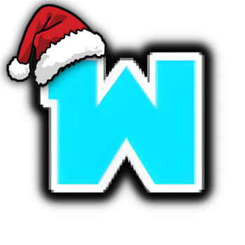

  

<h1 align="center">Wondercraft</h1>

<b>Next-Generation Server Configuration & Diagnostic Tracking Console</b>

  
  
  
  

---

Wondercraft is a sleek, professional web dashboard designed for server operations teams to collect system configuration checklists from clients, manage admin access levels, and track provisioning progress on a high-tech visual diagnostics timeline. 

Built with a premium **Cyber Cyan dark-mode theme**, the interface features glassmorphism, glowing accents, and fluid transitions to deliver a state-of-the-art console experience.

---

## 🌟 Key Capabilities

* 🛠️ **Dynamic Form Canvas**
  Build custom server specification templates on a responsive builder grid. Drag, reorder, toggle validation rules, and configure choice parameters on the fly using unified visual inputs.

* 📡 **Live Diagnostic Pipeline**
  Track incoming client request payloads inside the control console. Review specifications and update provisioning status in real-time.

* 🔮 **Interactive Ticket Tracking**
  Clients receive a unique reference token upon submission, allowing them to track server setup progress on a high-tech status board containing live progress steps:
  * **Queued for Auditing**
  * **Active Evaluation**
  * **Deployment Complete / Request Denied**

* 🔒 **Staff Roster Console**
  Super-administrators can manage access credentials, register new admin profiles, or pause/terminate existing console accounts dynamically.

---

## 🎨 Visual Design Tokens

* **Cyberpunk Aesthetic:** Deep slate backdrops combined with glowing neon-cyan indicators.
* **Responsive Layouts:** Sidebar and grid structures optimized for mobile, tablet, and widescreen monitors.
* **Fluid Motion:** Satisfying micro-interactions, canvas additions, and page route transitions powered by Framer Motion.
* **Clean Scrollbars:** Customized thin, color-matched scrollbars throughout the application.

---

  Wondercraft Server Operations. Built with Next.js, Tailwind CSS, Framer Motion, and MongoDB.

